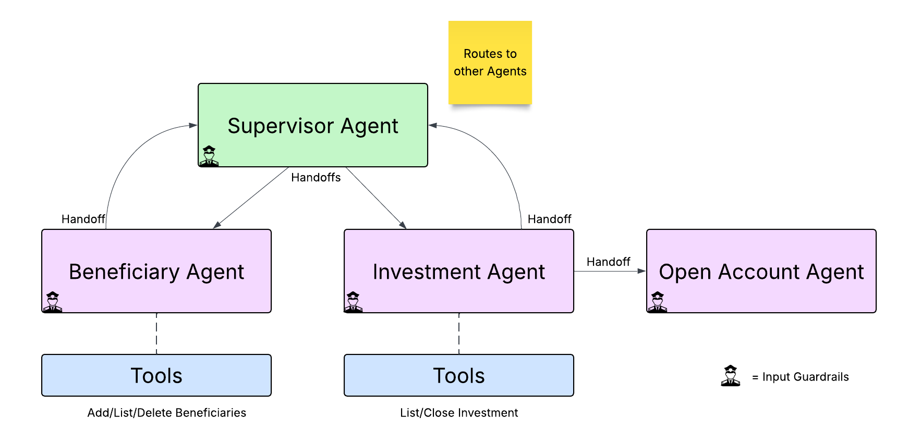

# Wealth Management Agent Example using OpenAI Agents SDK
Demonstrates how to use [OpenAI Agents SDK](https://openai.github.io/openai-agents-python/) using handoffs to other agents. 
Shows an example of just using OpenAI Agents SDK and another version that leverages [Temporal](https://temporal.io) to 
wrap the agentic flow with Temporal.



The basic OpenAI Agents SDK version of this example is located [here](src/basic/README.md).
The Temporal version of this example is located [here](src/temporal/README.md).

Scenarios currently implemented include
* Add Beneficiary - add a new beneficiary to your account
* List Beneficiaries - shows a list of beneficiaries and their relationship to the account owner
* Delete Beneficiary - delete a beneficiary from your account
* Open Investment Account - opens a new investment account - using a **child workflow** in the Temporal version. 
* List Investments - shows a list of accounts and their current balances
* Close Investment Account - closes an investment account

You can run through the scenarios with the Temporal version using a [Web Application](src/frontend/README.md) or

## Prerequisites

* [UV](https://docs.astral.sh/uv/) - Fast Python package installer and resolver
* [OpenAI API Key](https://platform.openai.com/api-keys) - Your key to accessing OpenAI's LLM
* [Temporal CLI](https://docs.temporal.io/cli#install) - Local Temporal service
* [Redis](https://redis.io/downloads/) - Stores conversation history and real-time status updates

## Set up Python Environment
```bash
uv sync
```

## Set up your Environment Variables

Create a `.env` file in the project root with your configuration:

```bash
cp .env.example .env
```

Now edit the `.env` file and configure your environment variables:
```text
# OpenAI Configuration
OPENAI_API_KEY=sk-proj-your-openai-api-key-here

# Temporal Configuration (defaults work for local development)
TEMPORAL_ADDRESS=127.0.0.1:7233
TEMPORAL_NAMESPACE=default
TEMPORAL_CERT_PATH=
TEMPORAL_KEY_PATH=
TEMPORAL_TASK_QUEUE=Supervisor

# Redis/Claim Check Configuration
USE_CLAIM_CHECK=true
REDIS_HOST=localhost
REDIS_PORT=6379
```

## Getting Started

See the basic OpenAI Agents SDK Version [here](src/basic/README.md)
And the Temporal version of this example is located [here](src/temporal/README.md)
