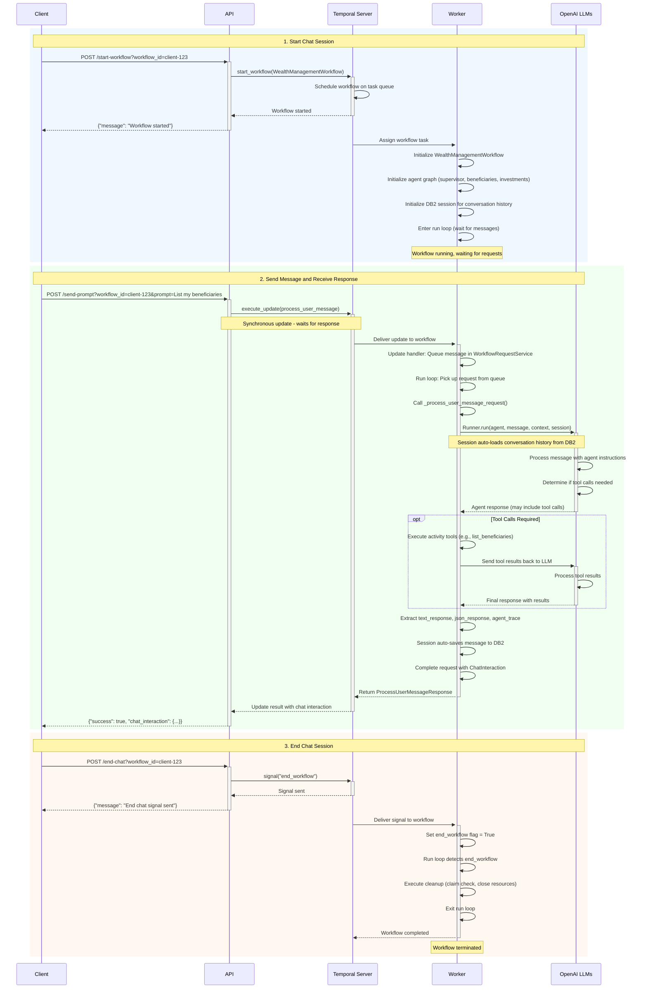

# Chat Flow Sequence Diagram

This document illustrates how chat interactions flow through the Temporal-based wealth management system.

## System Components

- **Client**: Frontend application or API consumer
- **API**: FastAPI server that handles HTTP requests
- **Temporal Server**: Orchestration engine managing workflows
- **Worker**: Python worker executing workflows and activities
- **OpenAI LLMs**: External AI service providing agent responses

## Complete Chat Flow

## Flow Details

### 1. Start Chat Session

**Endpoint**: `POST /start-workflow`

The workflow is started and enters a loop waiting for user messages:

1. Client sends request to start a new workflow with a unique workflow ID
2. API calls Temporal's `start_workflow()` to initiate the workflow
3. Temporal Server schedules the workflow execution on a task queue
4. Worker picks up the workflow task and:
   - Initializes the `WealthManagementWorkflow` instance
   - Creates the agent graph (supervisor, beneficiaries, investments agents)
   - Initializes a DB2 session for persistent conversation history
   - Enters the main run loop, waiting for messages or signals

### 2. Send Message and Receive Response

**Endpoint**: `POST /send-prompt`

The message is processed synchronously using Temporal's update mechanism:

1. Client sends a message prompt to the API
2. API calls `execute_update(process_user_message)` - a **synchronous operation** that waits for the response
3. Temporal Server delivers the update to the running workflow
4. Worker's update handler:
   - Queues the message in `WorkflowRequestService`
   - Main run loop picks up the request
   - Calls `_process_user_message_request()` which invokes `Runner.run()`
5. Worker communicates with OpenAI LLMs:
   - Session automatically loads conversation history from DB2
   - LLM processes the message with agent context
   - If tool calls are needed (e.g., listing beneficiaries), the worker executes activities and sends results back to the LLM
   - LLM generates final response
6. Worker processes the result:
   - Extracts text response, JSON data, and agent trace
   - Session automatically saves the interaction to DB2
   - Completes the request with a `ChatInteraction` object
7. Response flows back: Worker → Temporal Server → API → Client

### 3. End Chat Session

**Endpoint**: `POST /end-chat`

The workflow is gracefully terminated using a signal:

1. Client requests to end the chat session
2. API sends an `end_workflow` signal via Temporal
3. Temporal Server delivers the signal to the workflow
4. Worker sets the `end_workflow` flag to `True`
5. Main run loop detects the flag and:
   - Performs cleanup operations (claim check payloads, resources)
   - Exits the run loop
   - Workflow completes and terminates

## Key Architectural Features

### Synchronous Updates
The `execute_update()` mechanism ensures that each message gets a response before the next message is processed, maintaining conversation order and state consistency.

### Persistent Conversation History
The DB2 session automatically manages conversation history:
- Loads previous messages when `Runner.run()` is called
- Saves new interactions after each response
- Persists across workflow continue-as-new operations

### Agent Graph
Multiple specialized agents handle different domains:
- **Supervisor Agent**: Routes requests to appropriate specialized agents
- **Beneficiaries Agent**: Manages beneficiary operations
- **Investments Agent**: Handles investment accounts
- **Open Account Agent**: Manages account opening workflows

### Tool Execution
Agents can call activities as tools:
- `list_beneficiaries`, `add_beneficiary`, `delete_beneficiary`
- `list_investments`, `open_investment`, `close_investment`
- Tool results are sent back to the LLM for final response generation

## Implementation References

- **API Server**: `src/temporal/api/main.py`
- **Worker**: `src/temporal/run_worker.py`
- **Workflow**: `src/temporal/workflows/supervisor_workflow.py`
- **Request Service**: `src/temporal/services/workflow_request_service.py`
- **Session Management**: `src/temporal/session/temporal_db2_session.py`

